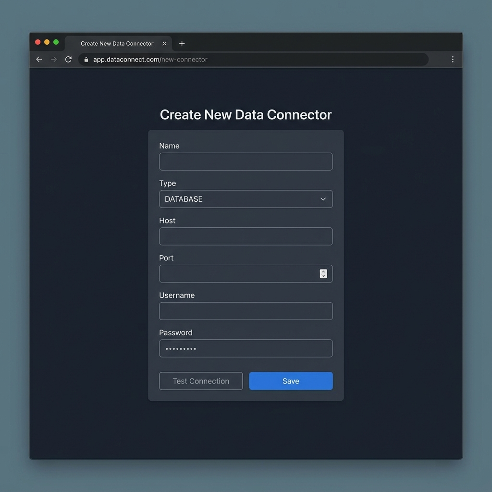

# Create Connector Screen

## Description
A desktop Dark Mode screen for registering a new data source.

## Key Features
- **Dynamic Form**: Fields change based on the selected `Type` (e.g., DATABASE vs REST_API).
- **Validation**: Real-time validation using Zod schema.
- **Actions**:
  - **Test Connection**: Verifies connectivity before saving.
  - **Save**: Persists the new connector configuration.

## Form Fields (Database Example)
- **Name**: Display name for the connector.
- **Type**: Dropdown (DATABASE, REST_API, FILE_SYSTEM).
- **Host**: Database hostname or IP.
- **Port**: Connection port.
- **Username**: Auth username.
- **Password**: Auth password (masked).
- **Database Name**: Target database.
