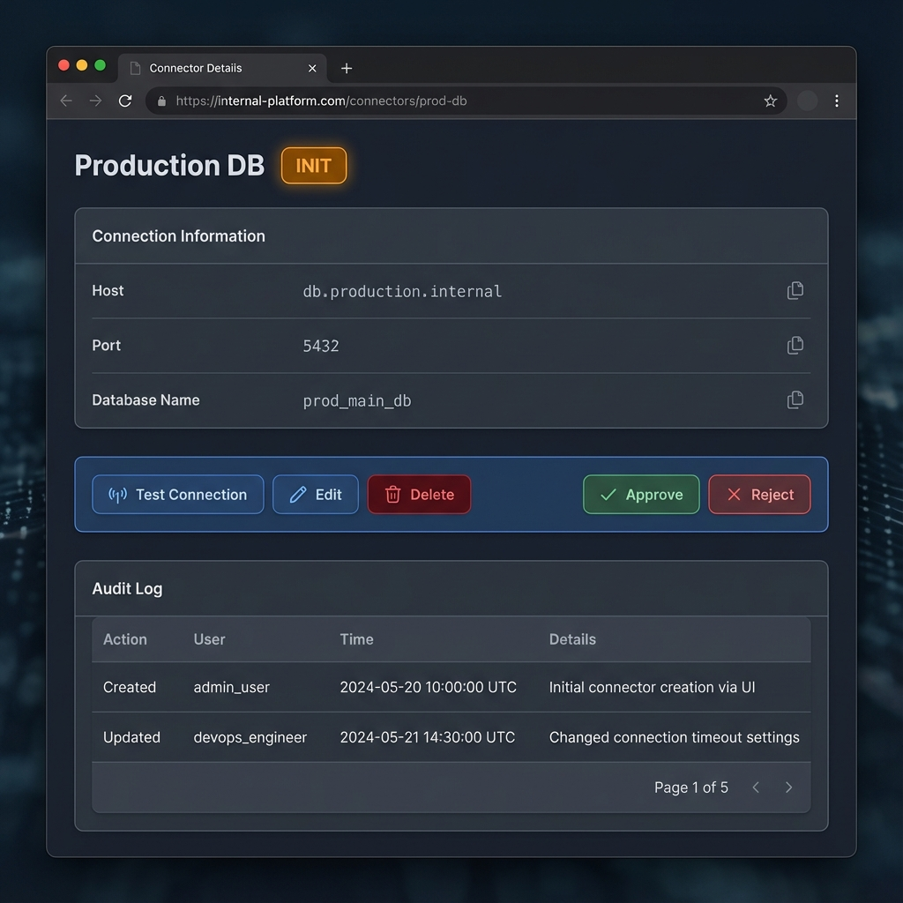

# Connector Details View

## Description
A read-only view displaying detailed information about a specific connector.

## Key Features
- **Header**: Displays Connector Name and Status Badge (INIT, APPROVED, REJECTED).
- **Info Section**: Read-only display of configuration (sensitive data like passwords masked).
- **Action Bar**:
  - **Test Connection**: Re-verify connectivity.
  - **Edit**: Navigate to Edit Screen.
  - **Delete**: Remove connector (requires confirmation modal).
  - **Approve/Reject**: Visible only when status is `INIT`.
- **Audit Log**: A history table tracking changes.

## Audit Log Columns
- **Action**: Created, Updated, Approved, Rejected.
- **User**: The user who performed the action.
- **Time**: Timestamp of the action.
- **Details**: Summary of changes (e.g., "Status changed from INIT to APPROVED").
