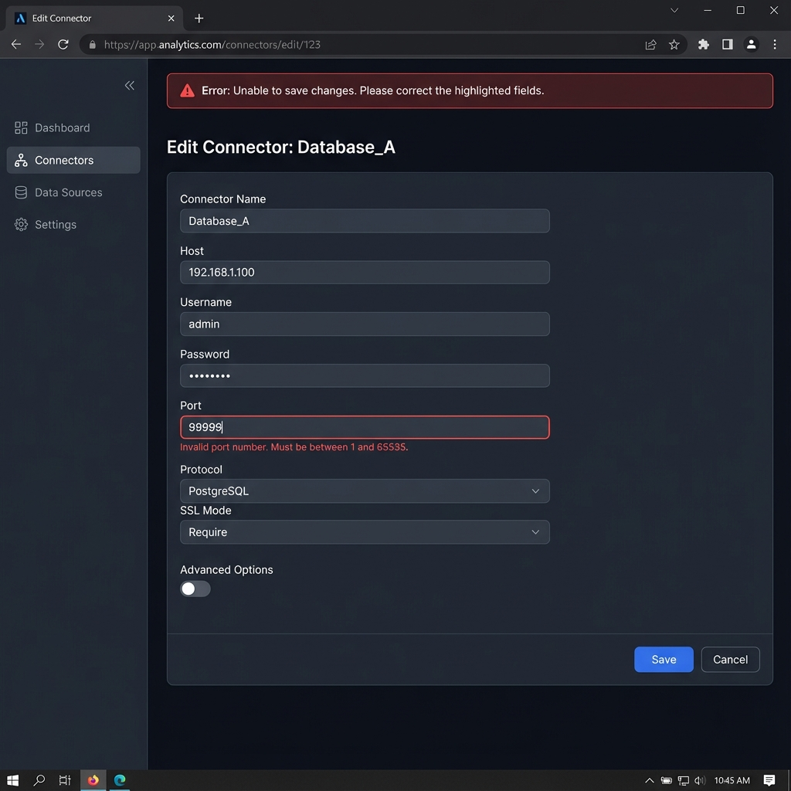

# Edit Connector Screen

## Description
Interface for modifying an existing connector's configuration.

## Key Features
- **Pre-filled Form**: Reuses the dynamic form from the Create Screen, populated with existing data.
- **Advanced Validation**:
  - **Inline Errors**: Red border and error message below invalid fields (e.g., "Invalid port number").
  - **Error Summary**: Alert at the top if submission fails.
- **Actions**:
  - **Save**: Updates the connector configuration.
  - **Cancel**: Returns to the Details View without saving.
