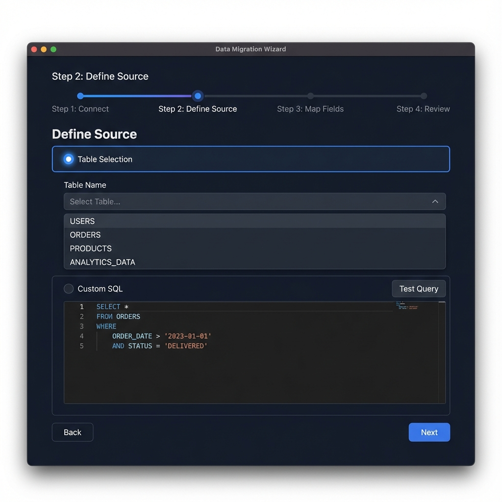
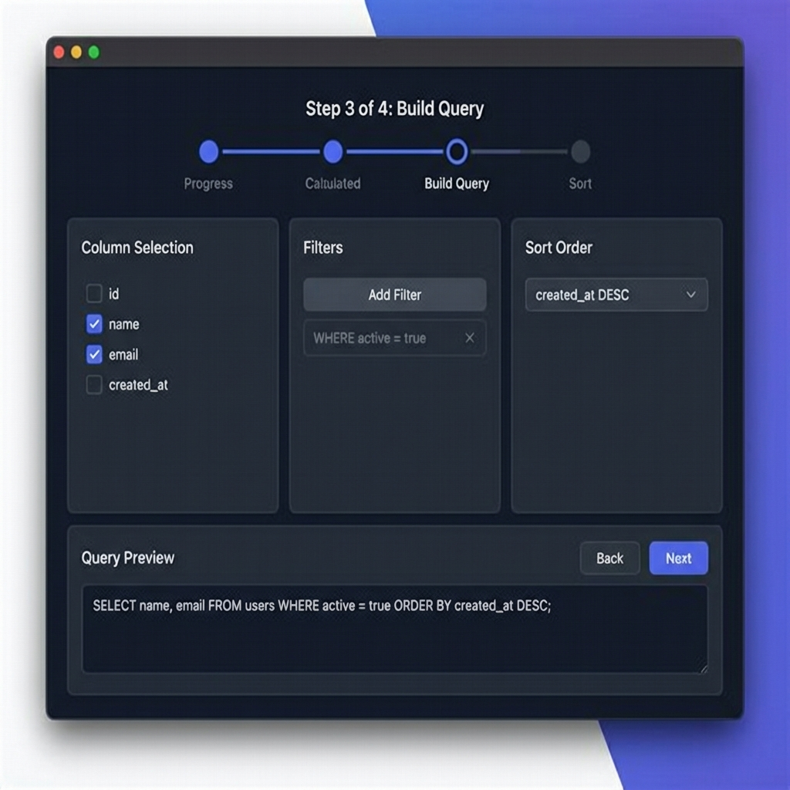
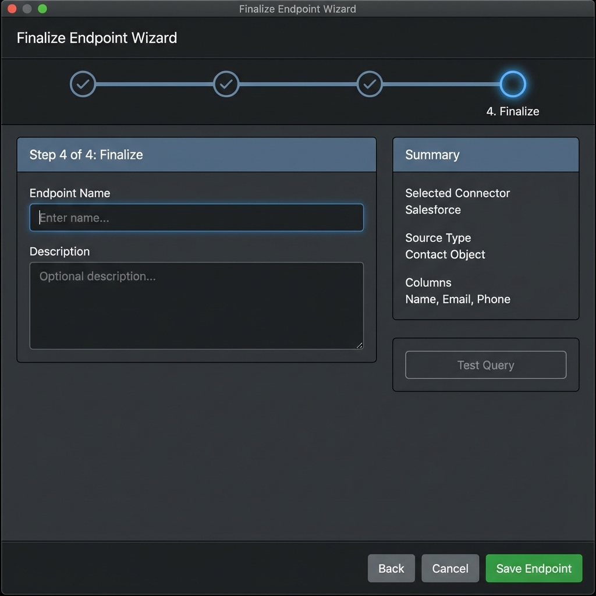
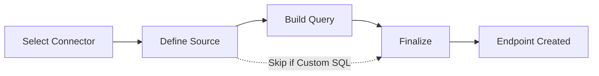

# Create Data Endpoint (Wizard) Screen

A multi-step wizard interface for creating data endpoints in desktop Dark Mode.

## Step 1: Select Connector

### Description
Choose the database connector to use as the data source.

### Key Features
- **Progress Indicator**: Shows current step (1 of 4).
- **Connector List**: Radio button selection of available database connectors.
- **Status Badges**: Each connector displays its status (Active, Pending Approval).
- **Filter**: Only show APPROVED connectors.
- **Navigation**: Next button to proceed.

---

## Step 2: Define Source

### Description
Define how data will be sourced from the selected connector.

### Key Features
- **Two Source Types**:
  - **Table Selection**: Simple dropdown to select a table from the database.
  - **Custom SQL**: Monaco Editor with:
    - SQL syntax highlighting
    - Auto-completion and IntelliSense
    - "Test Query" button to validate SQL
- **Navigation**: Back and Next buttons.

---

## Step 3: Build Query

### Description
Detailed query builder interface for table selection mode.

### Key Features
- **Column Selection**: Checkboxes to select which columns to include.
- **Filters**: 
  - Add multiple filter conditions
  - Support for operators (=, !=, >, <, LIKE, IN)
  - AND/OR logic
- **Sort Order**: Define column sorting (ASC/DESC).
- **Query Preview**: Live preview of generated SQL at the bottom.
- **Test Query**: Button to execute and preview results.
- **Navigation**: Back and Next buttons.

---

## Step 4: Finalize

### Description
Final step to name the endpoint and review configuration.

### Key Features
- **Endpoint Details**:
  - **Name**: Unique endpoint identifier (e.g., `/api/users`).
  - **Description**: Optional description of the endpoint.
- **Summary Section**: Review of:
  - Selected connector
  - Source type (Table/Custom SQL)
  - Selected columns
  - Applied filters
- **Test Query**: Final test before saving.
- **Actions**:
  - **Back**: Return to previous step.
  - **Cancel**: Discard and close wizard.
  - **Save Endpoint**: Create the endpoint (primary action).

---

## Wizard Flow

## Technical Notes

- **State Management**: Wizard state should be preserved when navigating back/forward.
- **Validation**: Each step should validate before allowing "Next".
- **Monaco Editor**: Use `@monaco-editor/react` for SQL editing.
- **Query Testing**: Mock API call to test queries before saving.
