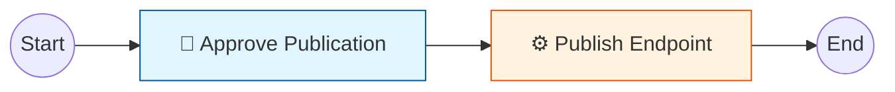

# 🔄 Data Endpoint Publishing Workflow

> **Workflow ID:** `endpoint-publishing`
> **Status:** ✅ Active (v1.0)
> **Engine:** Flowable 7.0.1

---

## 📖 Overview

The **Data Endpoint Publishing Workflow** enforces a governance layer on the creation of public data APIs. Instead of allowing any user to immediately publish an SQL query as an API, this workflow requires an approval step from an Administrator.

### Process Flow
1.  **Start:** A user (Analyst/Developer) requests to publish a `DRAFT` Data Endpoint.
2.  **User Task (Approval):** The system assigns a task to the `admin` group. An administrator must review the endpoint configuration (SQL query, masking rules).
3.  **Decision:**
    *   If **Approved**: The process proceeds to the publishing step.
    *   *(Future)* If **Rejected**: The process ends, and the endpoint remains in `DRAFT` (or moves to `REJECTED`).
4.  **Service Task (Publish):** The system automatically updates the Data Endpoint status to `PUBLISHED` (Active).
5.  **End:** The process completes.

---

## 🛠 BPMN Design

The process is defined in standard BPMN 2.0 XML.

**File:** `backend/src/main/resources/processes/endpoint-publishing.bpmn20.xml`



### Key Elements

| Element | ID | Description | Config |
| :--- | :--- | :--- | :--- |
| **User Task** | `approveTask` | Task for admins to review the request | `candidateGroups="admin"` |
| **Service Task** | `publishServiceTask` | Automated execution of business logic | `delegateExpression="${publishEndpointDelegate}"` |

---

## 💻 API Reference

The workflow is managed via the REST API at `/api/workflow`.

### 1. Start Process
Trigger this when a user clicks "Publish" in the UI.

- **POST** `/api/workflow/process-instance/publish-endpoint`
- **Request Body:**
  ```json
  {
    "endpointId": "ed150367-2d4e-4869-93e5-9f5635c2512f",
    "tenantId": "default"
  }
  ```
- **Response:**
  ```json
  {
    "processInstanceId": "2501",
    "status": "STARTED"
  }
  ```

### 2. List Pending Tasks
Fetch tasks for the "My Tasks" inbox or Admin Dashboard.

- **GET** `/api/workflow/tasks?group=admin`
- **Response:**
  ```json
  [
    {
      "id": "2505",
      "name": "Approve Publication",
      "assignee": null,
      "processInstanceId": "2501",
      "variables": {
        "endpointId": "ed150367-2d4e-4869-93e5-9f5635c2512f",
        "tenantId": "default"
      }
    }
  ]
  ```

### 3. Complete Task (Approve)
Call this when the Admin clicks "Approve".

- **POST** `/api/workflow/tasks/{taskId}/complete`
- **Response:** `200 OK`

---

## 🧩 Technical Implementation

### Java Delegate
The `PublishEndpointDelegate` component handles the actual logic of updating the database. It is a Spring Bean (`@Component("publishEndpointDelegate")`) injected into the Flowable engine.

```java
@Component("publishEndpointDelegate")
public class PublishEndpointDelegate implements JavaDelegate {
    // ... maps execution variables to Service call ...
    dataEndpointApplicationService.activateEndpoint(endpointId, tenantId);
}
```

### Integration Test
Verified by `FlowableIntegrationTest`, which mocks the specific service logic to ensure the workflow orchestrates correctly without depending on the real database state.
